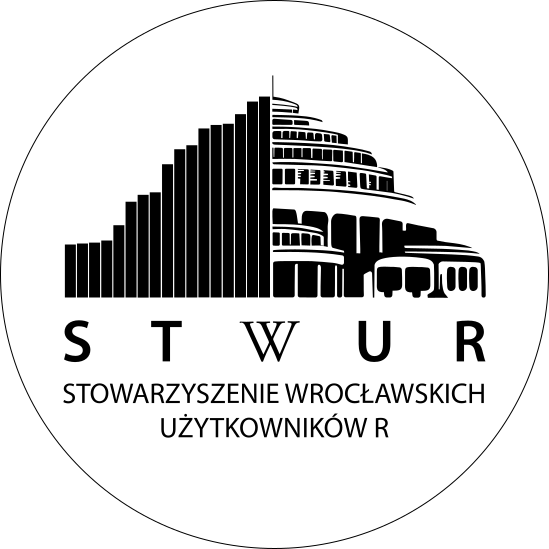
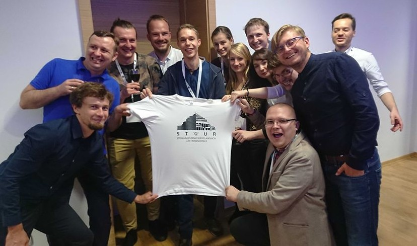
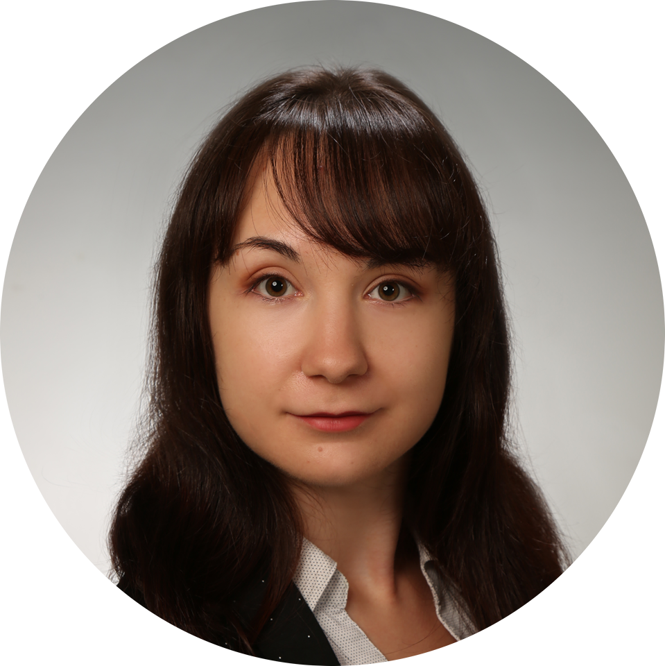
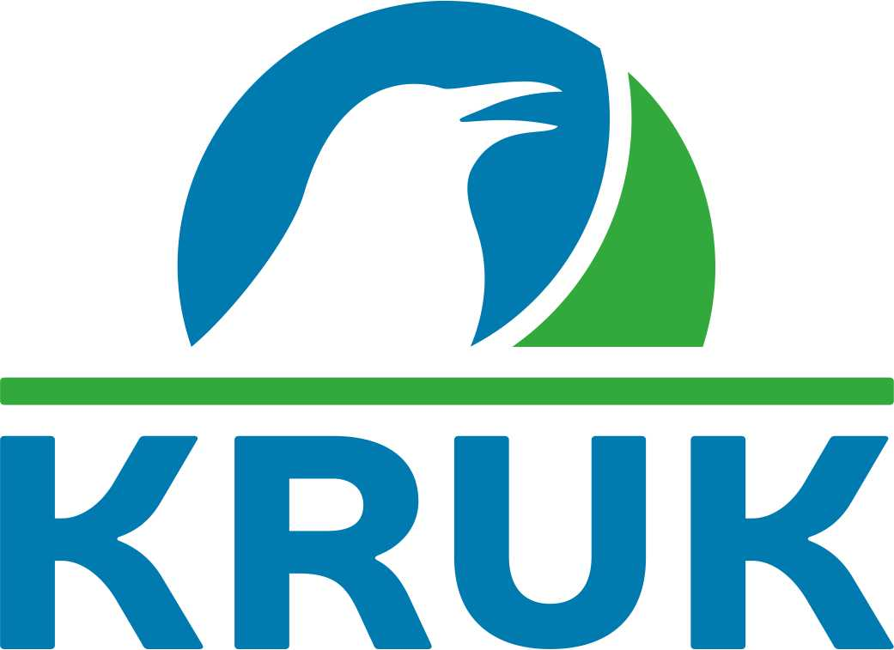
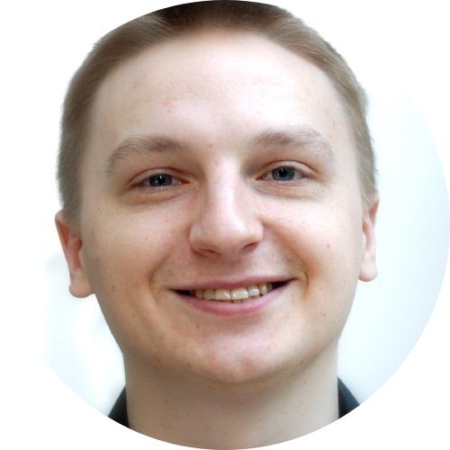
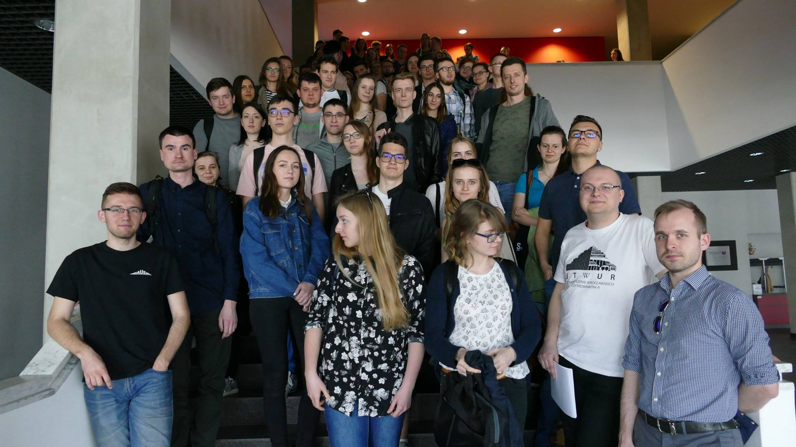
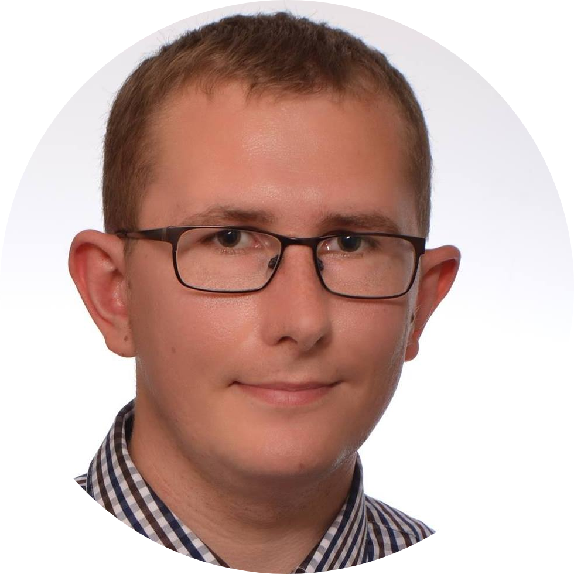

<link href="https://fonts.googleapis.com/css?family=Montserrat&display=swap" rel="stylesheet">

## Wprowadzenie

## Wprowadzenie

Społeczność wrocławskich użytkowników **R** skupiona wokół promocji data science. 

Pierwsze spotkanie: 30-01-2017.

## Certyfikaty

Link do formularza: https://tinyurl.com/qrhxfw9

## Plan spotkania

- **10:00-10:10 - otwarcie spotkania i krótki wstęp niemerytoryczny**
- 10:10-11:10 - wstęp do przetwarzania danych w R
- 11:10-11:20 - przerwa
- 11:20-12:15 - wizualizacja danych w R, cz. I
- 12:15-12:45 - prezentacja Kruk SA
- 12:45-13:30 - przerwa na pizzę
- 13:30-14:30 - wizualizacja danych w R, cz. II
- 14:30-14:45 - przerwa
- 14:45-15:30 - modelowanie w R
- 15:30-15:45 - grupowe zdjęcie
- 15:45-16:15 - wręczenie certyfikatów
- 16:30-… - planszówki w Schrimp House dla chętnych

## Wstęp do przetwarzania danych

- 10:00-10:10 - otwarcie spotkania i krótki wstęp niemerytoryczny
- **10:10-11:10 - wstęp do przetwarzania danych w R**
- 11:10-11:20 - przerwa
- 11:20-12:15 - wizualizacja danych w R, cz. I
- 12:15-12:45 - prezentacja Kruk SA
- 12:45-13:30 - przerwa na pizzę
- 13:30-14:30 - wizualizacja danych w R, cz. II
- 14:30-14:45 - przerwa
- 14:45-15:30 - modelowanie w R- 15:30-15:45 - grupowe zdjęcie
- 15:45-16:15 - wręczenie certyfikatów
- 16:30-… - planszówki w Schrimp House dla chętnych

**Katarzyna Sidorczuk**: Bioinformatyk, doktorantka na Wydziale Biotechnologii Uniwersytetu Wrocławskiego.

## Przerwa

- 10:00-10:10 - otwarcie spotkania i krótki wstęp niemerytoryczny
- 10:10-11:10 - wstęp do przetwarzania danych w R
- **11:10-11:20 - przerwa**
- 11:20-12:15 - wizualizacja danych w R, cz. I
- 12:15-12:45 - prezentacja Kruk SA
- 12:45-13:30 - przerwa na pizzę
- 13:30-14:30 - wizualizacja danych w R, cz. II
- 14:30-14:45 - przerwa
- 14:45-15:30 - modelowanie w R
- 15:30-15:45 - grupowe zdjęcie
- 15:45-16:15 - wręczenie certyfikatów
- 16:30-… - planszówki w Schrimp House dla chętnych

 
 
## Wizualizacja danych

- 10:00-10:10 - otwarcie spotkania i krótki wstęp niemerytoryczny
- 10:10-11:10 - wstęp do przetwarzania danych w R
- 11:10-11:20 - przerwa
- **11:20-12:15 - wizualizacja danych w R, cz. I**
- 12:15-12:45 - prezentacja Kruk SA
- 12:45-13:30 - przerwa na pizzę
- 13:30-14:30 - wizualizacja danych w R, cz. II
- 14:30-14:45 - przerwa
- 14:45-15:30 - modelowanie w R
- 15:30-15:45 - grupowe zdjęcie
- 15:45-16:15 - wręczenie certyfikatów
- 16:30-… - planszówki w Schrimp House dla chętnych

**Michał Burdukiewicz**: Bioinformatyk, wykładowca (MI2 DataLab, Wydział Matematyki i Nauk Informacyjnych PW), pasjonat i popularyzator **R**, współzałożyciel STWURa, Fundacji Why R? i DKNB, współorganizator największej polskiej konferencji o **R** i ża**R**łok. 

 
 
## Prezentacja Kruk SA

- 10:00-10:10 - otwarcie spotkania i krótki wstęp niemerytoryczny
- 10:10-11:10 - wstęp do przetwarzania danych w R
- 11:10-11:20 - przerwa
- 11:20-12:15 - wizualizacja danych w R, cz. I
- **12:15-12:45 - prezentacja Kruk SA**
- 12:45-13:30 - przerwa na pizzę
- 13:30-14:30 - wizualizacja danych w R, cz. II
- 14:30-14:45 - przerwa
- 14:45-15:30 - modelowanie w R
- 15:30-15:45 - grupowe zdjęcie
- 15:45-16:15 - wręczenie certyfikatów
- 16:30-… - planszówki w Schrimp House dla chętnych

 
 
## Przerwa na pizzę

- 10:00-10:10 - otwarcie spotkania i krótki wstęp niemerytoryczny
- 10:10-11:10 - wstęp do przetwarzania danych w R
- 11:10-11:20 - przerwa
- 11:20-12:15 - wizualizacja danych w R, cz. I
- 12:15-12:45 - prezentacja Kruk SA
- **12:45-13:30 - przerwa na pizzę**
- 13:30-14:30 - wizualizacja danych w R, cz. II
- 14:30-14:45 - przerwa
- 14:45-15:30 - modelowanie w R
- 15:30-15:45 - grupowe zdjęcie
- 15:45-16:15 - wręczenie certyfikatów
- 16:30-… - planszówki w Schrimp House dla chętnych

Pizzeria Bravo:

 - 14 x Uczta serowa 
 - 14 x Meksykańska 
 - 14 x Bravo 
 - 14 x Pepperoni 
 - 14 x Ciuriosita 

  

## Modelowanie w R

- 10:00-10:10 - otwarcie spotkania i krótki wstęp niemerytoryczny
- 10:10-11:10 - wstęp do przetwarzania danych w R
- 11:10-11:20 - przerwa
- 11:20-12:15 - wizualizacja danych w R, cz. I
- 12:15-12:45 - prezentacja Kruk SA
- 12:45-13:30 - przerwa na pizzę
- 13:30-14:30 - wizualizacja danych w R, cz. II
- 14:30-14:45 - przerwa
- **14:45-15:30 - modelowanie w R**
- 15:30-15:45 - grupowe zdjęcie
- 15:45-16:15 - wręczenie certyfikatów
- 16:30-… - planszówki w Schrimp House dla chętnych

**Mateusz Staniak**: Doktorant w Instytucie Matematycznym UWr zajmujący się biostatystyką. Statystyk, programista R, freelancer.

  

## Grupowe zdjęcie

- 10:00-10:10 - otwarcie spotkania i krótki wstęp niemerytoryczny
- 10:10-11:10 - wstęp do przetwarzania danych w R
- 11:10-11:20 - przerwa
- 11:20-12:15 - wizualizacja danych w R, cz. I
- 12:15-12:45 - prezentacja Kruk SA
- 12:45-13:30 - przerwa na pizzę
- 13:30-14:30 - wizualizacja danych w R, cz. II
- 14:30-14:45 - przerwa
- 14:45-15:30 - modelowanie w R
- **15:30-15:45 - grupowe zdjęcie**
- 15:45-16:15 - wręczenie certyfikatów
- 16:30-… - planszówki w Schrimp House dla chętnych

  

## Wręczenie certyfikatów

- 10:00-10:10 - otwarcie spotkania i krótki wstęp niemerytoryczny
- 10:10-11:10 - wstęp do przetwarzania danych w R
- 11:10-11:20 - przerwa
- 11:20-12:15 - wizualizacja danych w R, cz. I
- 12:15-12:45 - prezentacja Kruk SA
- 12:45-13:30 - przerwa na pizzę
- 13:30-14:30 - wizualizacja danych w R, cz. II
- 14:30-14:45 - przerwa
- 14:45-15:30 - modelowanie w R
- 15:30-15:45 - grupowe zdjęcie
- **15:45-16:15 - wręczenie certyfikatów**
- 16:30-… - planszówki w Schrimp House dla chętnych

Certyfikaty odbieramy w holu na dole schodów.

Jeśli jeszcze Twoje dane nie są na meetupie/formularzu, to najwyższy czas je dodać :)  

Link do formularza: https://tinyurl.com/qrhxfw9

  

## Grupowe zdjęcie

- 10:00-10:10 - otwarcie spotkania i krótki wstęp niemerytoryczny
- 10:10-11:10 - wstęp do przetwarzania danych w R
- 11:10-11:20 - przerwa
- 11:20-12:15 - wizualizacja danych w R, cz. I
- 12:15-12:45 - prezentacja Kruk SA
- 12:45-13:30 - przerwa na pizzę
- 13:30-14:30 - wizualizacja danych w R, cz. II
- 14:30-14:45 - przerwa
- 14:45-15:30 - modelowanie w R
- 15:30-15:45 - grupowe zdjęcie
- 15:45-16:15 - wręczenie certyfikatów
- **16:30-… - planszówki w Shrimp House dla chętnych**

Duże podziękowania dla Bartosza Pawliczaka za organizację planszówek! 

  

## Podziękowania

Sponsor: Kruk SA.

Instruktorzy: Koło Naukowe Statystyki Matematycznej Gauss, Doktoranckie Koło Naukowe Bioinformatyki.

Wsparcie organizacyjne: Fundacja Why R?.

Partnerzy medialni: MLinPL, R-Ladies Warsaw.
