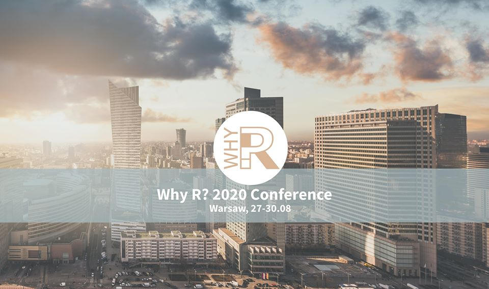
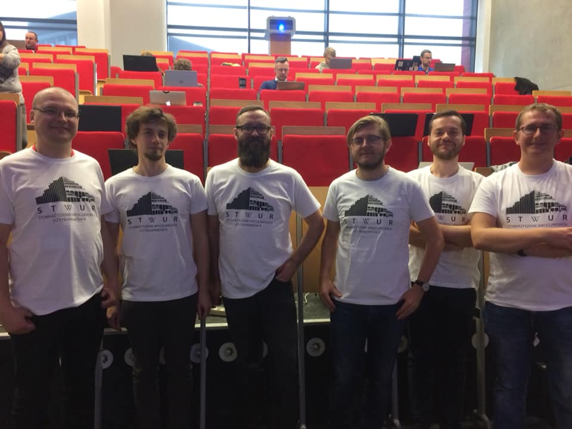
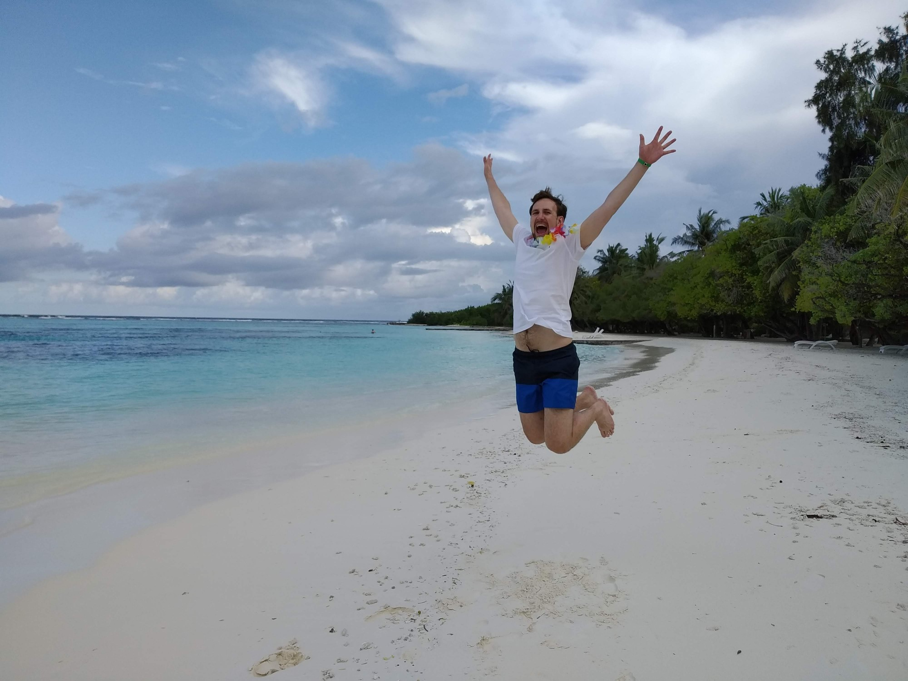
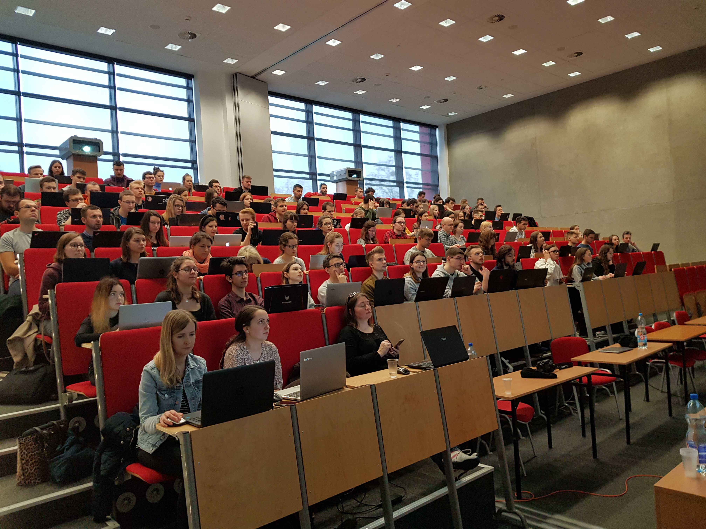

<link href="https://fonts.googleapis.com/css?family=Montserrat&display=swap" rel="stylesheet">

<style>
slides > slide {
  font-family: 'Montserrat', sans-serif;
}

.center {
  display: block;
  margin-left: auto;
  margin-right: auto;

}


</style>


## Konferencja Why R? 2020



https://2020.whyr.pl/

## Podziękowania

<div style="float: left; width: 50%; font-size:20px;">

 - Paweł Bogdan
 - Łukasz Bombała
 - **Jarosław Chilimoniuk**
 - Mateusz Czupała
 - Marcin Kucharski
 - Łukasz Łaszczuk
 - Maciej Małecki
 - Maciej Kasiński

</div>

<div style="float: right; width: 50%; font-size:20px;">

 - Bartosz Pawliczak
 - **Filip Pietluch**
 - Daria Puchalska
 - Dominik Rafacz
 - Katarzyna Sidorczuk
 - Patryk Wielopolski

</div>


## Podziękowania



Bartłomiej Karaban, Bartosz Kolasa, Michał Kurtys.

## Podziękowania

A także:

 - Jakub Kwiecień,
 - Mateusz Staniak.
 
## Podziękowania specjalne



Piotr Sobczyk, http://szychtawdanych.pl/

## Podziękowania



## Pożegnanie

```{r, echo=FALSE,message=FALSE}
library(dplyr)
library(ggplot2)
library(reshape2)
read.table("dane.txt") %>% 
  setNames(c("Data", "Uczestnicy", "Pizze")) %>% 
  mutate(Data = as.Date(Data, format = "%d-%m-%Y")) %>% 
  melt(id.vars = "Data") %>% 
  ggplot(aes(x = Data, y = value, fill = variable)) +
  geom_col(position = "dodge") +
  geom_label(aes(x = Data, y = 10, label = Data), inherit.aes = FALSE,
             size = 2.8) +
  scale_y_continuous("Liczba") +
  scale_fill_manual("", 
                    values = c(Pizze = "#f1a340", Uczestnicy = "#998ec3")) +
  theme_bw() +
  theme(legend.position = "bottom")
```

836 uczestników eRementarzy.

## Pożegnanie

Od 30-01-2017:

 - 30 spotkań STWURa i WAMPiRa (Wrocławski Alians Miłośników Pythona i **R**),
 - Why R? 2018: międzynarodowa konferencja użytkowników **R** we Wrocławiu,
 - stała współpraca z uczelniami, kołami naukowymi i wrocławskimi firmami z sektora data science,
 - Wigilia Data Science :) 
 
## Pożegnanie

- https://github.com/michbur
- https://www.linkedin.com/in/michal-burdukiewicz/

## Social media

 - https://www.facebook.com/stwur/
 - https://www.facebook.com/whyRconf/

## Podziękowania

Sponsor: Kruk SA.

Instruktorzy: Koło Naukowe Statystyki Matematycznej Gauss, Doktoranckie Koło Naukowe Bioinformatyki.

Wsparcie organizacyjne: Fundacja Why R?.

Partnerzy medialni: MLinPL, R-Ladies Warsaw.
